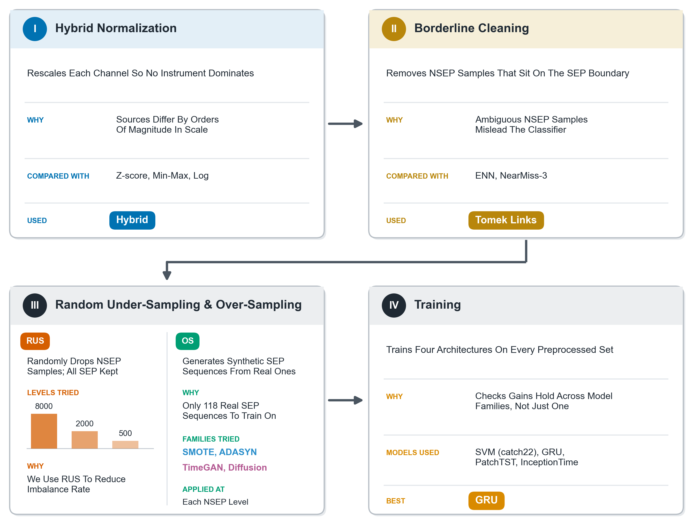
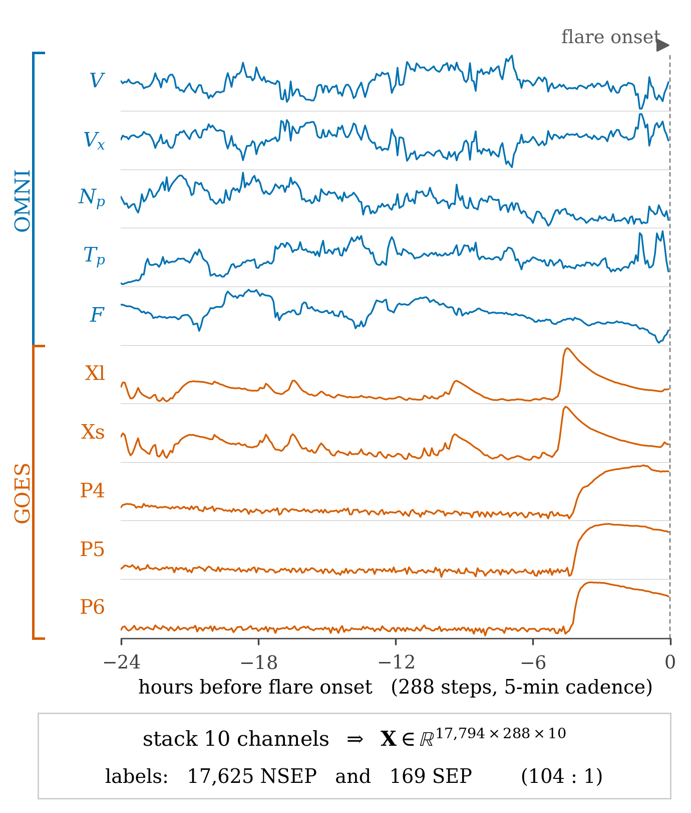
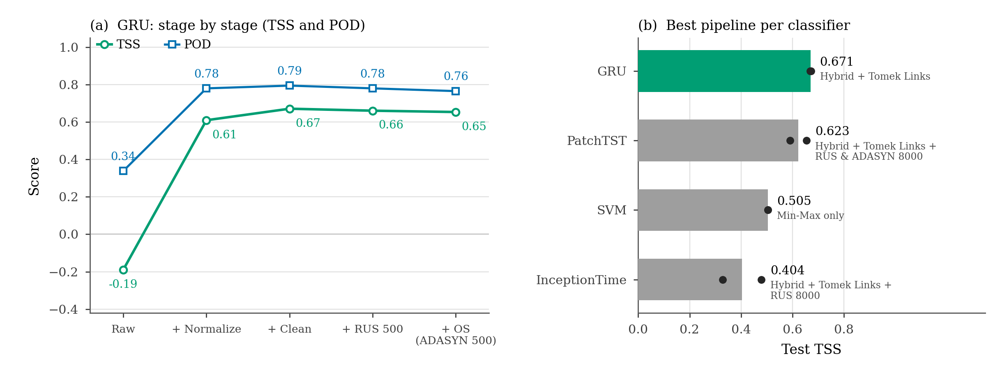
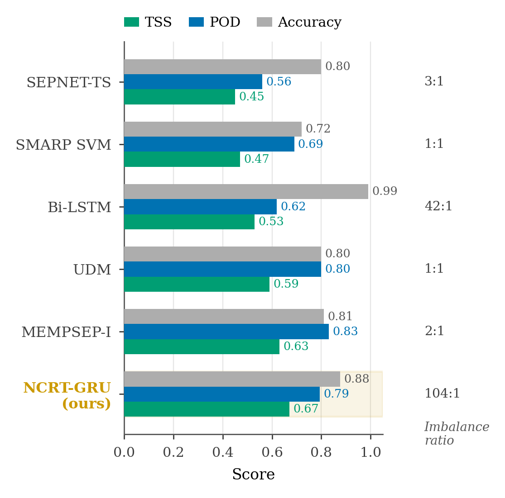

## Normalize, Clean, Resample: An End-to-End Pipeline Study for Solar Energetic Particle Forecasting"

## Abstract

Solar energetic particle (SEP) events are rare, high-impact space weather phenomena that pose serious radiation hazards to astronauts and polar-route aircraft crews, damage satellite electronics, and disrupt satellite communications and navigation systems, and forecasting them from multivariate time series is complicated by extreme class imbalance: in our dataset, SEP events comprise under 1% of samples. We present a systematic, stage-by-stage study of the preprocessing pipeline for SEP forecasting: normalization, borderline data cleaning, and class rebalancing, evaluated across both classical and state-of-the-art classifiers (SVM, GRU, PatchTST, InceptionTime). We compare classical interpolation-based over sampling (SMOTE, ADASYN) against two generative approaches, TimeGAN and a state-of-the-art diffusion model, for synthesizing minority-class sequences from only 118 real SEP events. Using the True Skill Statistic, we find that our novel hybrid log/z-score normalization and Tomek Links cleaning yield the largest gains, while classical over sampling methods consistently outperform both generative approaches in this data-scarce regime. Our best configuration (GRU with Hybrid normalization and Tomek Links cleaning) achieves a TSS of 0.67 on a held-out test set.

## Pipeline Overview



The pipeline evaluated in this work has four stages, each isolated and measured independently before being combined:

1. **Normalization** — Hybrid log/z-score normalization vs. three uniform baselines (Z-score, Min-Max, Log)
2. **Borderline cleaning** — Tomek Links vs. Edited Nearest Neighbors (ENN) and NearMiss-3
3. **Random under sampling (RUS)** — majority-class reduction at several severities
4. **Over sampling** — classical (SMOTE, ADASYN) vs. generative (TimeGAN, diffusion) synthesis of minority-class (SEP) sequences

Each stage is evaluated across four classifiers: SVM, GRU, PatchTST, and InceptionTime.



## Repository Structure

```
├── dataset/                        # Raw per-channel OMNI/GOES time series (gzipped CSVs)
│   ├── F.csv.gz, Np.csv.gz, P4.csv.gz, P5.csv.gz, P6.csv.gz,
│   │   Tp.csv.gz, V.csv.gz, Vx.csv.gz, Xl.csv.gz, Xs.csv.gz
│
├── masked-ts-diffusion/            # Causal-attention DDPM implementation used for
│   ├── model.py                    # generative over-sampling
│   ├── api.py
│   └── __init__.py
│
├── timegan.py                      # TimeGAN implementation used for generative over-sampling
├── discriminative_metrics.py       # Discriminative-score utilities for synthetic-sample evaluation
├── utils.py                        # Shared helper functions
│
├── 0_Dependancies.ipynb            # Environment setup / package installation
├── 1_DataPreparation.ipynb         # Builds the MVTS dataset, chronological train/val/test split
├── 2_ImpactsOfNormalization.ipynb  # Normalization experiments (Hybrid, Z-score, Min-Max, Log)
├── 2.1_InitialClassification.ipynb # Baseline classifier hyperparameter search
├── 3_BorderlineCleaning.ipynb      # Borderline-cleaning experiments (Tomek Links, ENN, NearMiss-3)
├── 4_RandomUnderSampling.ipynb     # RUS-alone experiments at several retained-NSEP levels
├── 5_RUS&OS-SMOTE.ipynb            # RUS + SMOTE over-sampling experiments
├── 6_RUS&OS-TimeGAN.ipynb          # RUS + TimeGAN generation and training
├── 7_RUS&OS-TimeGAN-Results.ipynb  # RUS + TimeGAN classification results
├── 8_RUS&OS-Adasyn.ipynb           # RUS + ADASYN over-sampling experiments
├── 9_RUS&OS-Diffusion.ipynb        # RUS + diffusion-model generation and training
├── 10_RUS&OS-Diffusion-Results.ipynb # RUS + diffusion-model classification results
│
├── 11_Figures_Style.ipynb          # Shared plotting style/colors and result-loading utilities
├── 12_Figures_Preprocessing.ipynb  # Figure: normalization / cleaning / RUS sweep
├── 13_Figures_DesignChoices.ipynb  # Figure: augmentation algorithm comparison
├── 14_Figures_Progression.ipynb    # Figure: end-to-end pipeline stage progression
├── 15_Figures_NewInsights.ipynb    # Additional analysis figures
├── 16_Figures_Dataset.ipynb        # Figure: dataset/class-imbalance overview
├── 17_Figures_Pipeline.ipynb       # Figure: pipeline schematic diagram
├── 18_Figures_AugmentationAndBaselines.ipynb # Figure: augmentation trends and published-baseline comparison
├── 19_Figures_TSNE_KDE.ipynb       # Figure: t-SNE/KDE comparison of real vs. synthetic SEP sequences
│
├── figures/                        # Rendered output figures (see below)
├── requirements / 0_Dependancies.ipynb
├── LICENSE
└── README.md
```

## Setup

```bash
pip install pandas numpy matplotlib seaborn tqdm scikit-learn scipy imbalanced-learn tensorflow sktime torch
```

(`0_Dependancies.ipynb` installs the core list above; `torch` is additionally required for the GRU, PatchTST, InceptionTime, and diffusion-model implementations used in later notebooks.)

## How to Use the Notebooks

Run the notebooks in numeric order — each stage's output is the input to the next:

1. **`0_Dependancies.ipynb`** — installs required packages. Run once.
2. **`1_DataPreparation.ipynb`** — builds the multivariate time series dataset from the raw per-channel CSVs in `dataset/`, and produces the chronological 70/10/20 train/validation/test split used by every downstream experiment.
3. **`2_ImpactsOfNormalization.ipynb`** / **`2.1_InitialClassification.ipynb`** — evaluate the four normalization schemes (Hybrid, Z-score, Min-Max, Log) and select classifier hyperparameters.
4. **`3_BorderlineCleaning.ipynb`** — applies Tomek Links, ENN, and NearMiss-3 to the best-normalized training set and compares results.
5. **`4_RandomUnderSampling.ipynb`** — evaluates RUS alone, at several retained-NSEP levels, on the cleaned training set.
6. **`5_RUS&OS-SMOTE.ipynb`**, **`6_RUS&OS-TimeGAN.ipynb`** / **`7_RUS&OS-TimeGAN-Results.ipynb`**, **`8_RUS&OS-Adasyn.ipynb`**, **`9_RUS&OS-Diffusion.ipynb`** / **`10_RUS&OS-Diffusion-Results.ipynb`** — combine RUS with each of the four over-sampling methods (classical: SMOTE, ADASYN; generative: TimeGAN, diffusion) at every shared configuration, and report classification results.
7. **`11`–`19` (`*_Figures_*.ipynb`)** — regenerate every figure in the paper from the saved experiment results. Run `11_Figures_Style.ipynb` first in the same kernel session (it defines the shared color palette and result-loading helpers the later figure notebooks depend on), then run any of `12`–`19` as needed.

Each notebook documents its own expected inputs/outputs in its first markdown cell.

## Figures

| | |
|---|---|
|  |  |
|  |  |

## License

MIT License — see [LICENSE](LICENSE).
